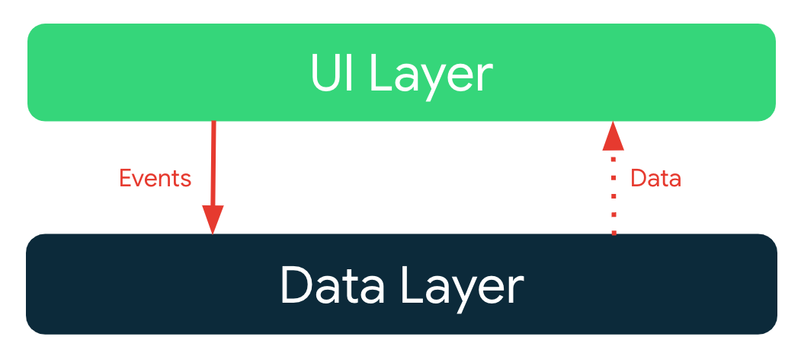
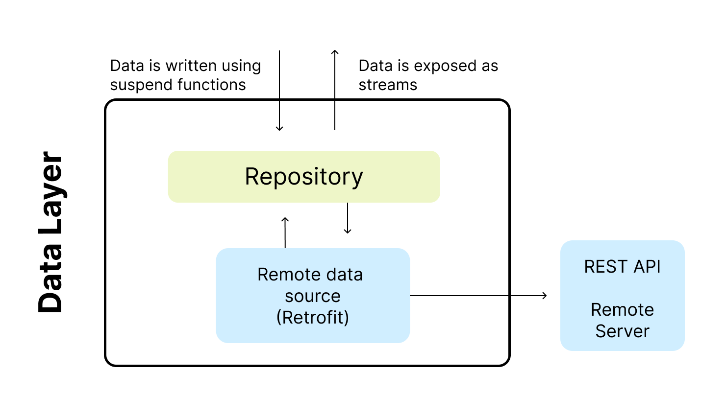

# Viaje de aprendizaje de arquitectura

En este viaje de aprendizaje aprenderá sobre la arquitectura de la aplicación Albo Challenge: sus capas, clases clave y las interacciones entre ellas.

## Metas y requisitos

Los objetivos de la arquitectura de la aplicación son:

*   Siga la [guía de arquitectura oficial](https://developer.android.com/jetpack/guide) lo mas cercano posible.
*   Fácil de entender para los desarrolladores, nada demasiado experimental.
*   Admite que varios desarrolladores trabajen en la misma base de código.
*   Minimizar los tiempos de construcción.

## Descripción general de la arquitectura

La arquitectura de la aplicación tiene dos capas: una [capa de datos](https://developer.android.com/jetpack/guide/data-layer) y [capa de interfaz de usuario](https://developer.android.com/jetpack/guide/ui-layer)

La arquitectura sigue un modelo de programación reactiva con [flujo de datos unidireccional](https://developer.android.com/jetpack/guide/ui-layer#udf). Con la capa de datos en la parte inferior, los conceptos clave son:

*   Las capas superiores reaccionan a los cambios en las capas inferiores.
*   Los eventos fluyen hacia abajo.
*   Los datos fluyen hacia arriba.

El flujo de datos se logra mediante flujos, implementados mediante [Kotlin Flows] up.(https://developer.android.com/kotlin/flow).

## Capa de datos

La capa de datos se implementa para conectarse a nuestro servicio web, en este caso es la fuente de datos de la aplicación.

El repositorio tiene su propio modelo. Por ejemplo, el `Value Repository` tiene un modelo de `Value Response`.

Los repositorios son la API pública para otras capas y proporcionan la _única_ forma de acceder a los datos de la aplicación. Los repositorios suelen ofrecer uno o más métodos para leer y escribir datos.

## Capa de interfaz de usuario

La [capa de interfaz de usuario](https://developer.android.com/topic/architecture/ui-layer) comprende:

*   Elementos de la interfaz de usuario creados con [Jetpack Compose](https://developer.android.com/jetpack/compose)
*   [Android ViewModels](https://developer.android.com/topic/libraries/architecture/viewmodel)

Los ViewModels reciben flujos de datos de los repositorios y los transforman en un estado de interfaz de usuario. Los elementos de la interfaz de usuario reflejan este estado y brindan formas para que el usuario interactúe con la aplicación. Estas interacciones se pasan como eventos al modelo de vista donde se procesan.

### Modelado del estado de la interfaz de usuario

El estado de la interfaz de usuario se modela como una jerarquía sellada utilizando interfaces y clases de datos inmutables. Los objetos de estado solo se emiten mediante la transformación de flujos de datos. Este enfoque garantiza que:

*    el estado de la interfaz de usuario siempre representa los datos subyacentes de la aplicación: los datos de la aplicación son la fuente de la verdad.
*    los elementos de la interfaz de usuario manejan todos los estados posibles.

