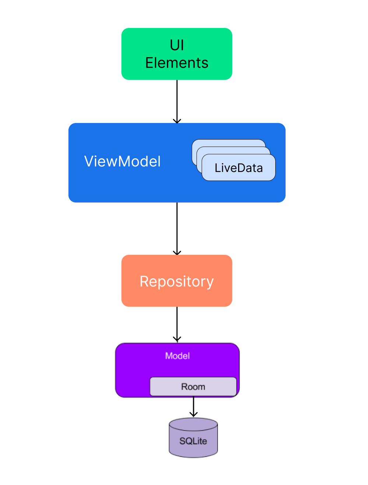

# Case Study

### Present a specific scenario (for example, a to-do list application) and ask the candidate to outline how they would structure the application using MVVM, LiveData, Room, Koin and Retrofit.
### They may include architecture diagrams and code snippets to explain their approach.

**Contexts**
In this section, we present a complete use case to demonstrate how to structure an app.
Imagine that we are creating a UI that shows a list of tasks to the user. We use a local database to fetch and save data for a given task.


**Overview**
Start by reviewing the following diagram, which shows how all the modules need to interact with each other after the app is created.



Note that each component depends only on the one that is one level below it. For example, Ui components only depend on the view model. The repository is the only class that depends on several other classes. In this example, the repository relies on a persistent data model.


**Create the user interface**
The UI can consist of an Activity, Fragment or a Composable Screen.

- **Examples of Activity UI**

```
class TasksActivity : AppCompatActivity() {
    private val viewModel by viewModel<TasksViewModel>()

    override fun onCreate(savedInstanceState: Bundle?) {
        super.onCreate(savedInstanceState)

        val binding = ActivityTasksBinding.inflate(layoutInflater)
        setContentView(binding.root)
        
        viewModel.tasks.observe(this) { result -> 
            // update UI
        }
    }
}
```

- **Examples of Fragment UI**

```
class TasksFragment : Fragment() {
    private val viewModel by viewModel<TasksViewModel>()

    override fun onCreateView(
        inflater: LayoutInflater, container: ViewGroup?,
        savedInstanceState: Bundle?
    ): View {
        return inflater.inflate(R.layout.main_fragment, container, false)
    }

    override fun onViewCreated(view: View, savedInstanceState: Bundle?) {
        super.onViewCreated(view, savedInstanceState)
        prepareObservers()
    }
    
    private fun prepareObservers() {
        viewModel.tasks.observe(viewLifecycleOwner) { result -> 
            // update UI
        }
    }
}
```

- **Examples of Compose UI**

```
class TasksActivity : ComponentActivity() {

    override fun onCreate(savedInstanceState: Bundle?) {
        super.onCreate(savedInstanceState)
        
        setContent {
            val tasks = remember { mutableStateOf(Tasks()) }
        
            val viewModel = koinViewModel<TasksViewModel>()
            viewModel.tasks.observe(this) { result -> tasks.value = result }
        
            MaterialTheme {
                TasksScreen(
                    viewmodel,
                    tasks
                )
            }
        }
    }
}
```


- **Examples of ViewModel**

We use a TasksViewModel based on the ViewModel architecture component to get data.

```
class MainViewModel(private val repository: TasksRepository) : ViewModel() {

    private val _tasks = MutableLiveData<List<Task>>()
    val tasks: LiveData<List<Task>> = _tasks
    
    fun getTasks() {
        repository.getTasks()
            .onEach { result ->
                _tasks.value = result
            }
            .catch {
                // todo error case
            }
            .launchIn(viewModelScope)
    }
```


**Fetch data**

Now that we have used LiveData to connect ViewModel to UI, how can we fetch the tasks data?

Repository modules handle data operations. They provide a clean API so that the rest of the app can retrieve this data easily. They know where to collect the data and what API calls need to be made when the data is updated. You can think of repositories as mediators between different data sources, for example persistent models, web services, and caches.

```
interface TasksRepository {
    fun getTasks() : Flow<List<Task>>
}

class TasksRepositoryImpl(private val taskDao: TaskDao): TasksRepository {
    override fun getTasks() = flow {
        emit(taskDao.getTasks())
    }
}
```

**Persist on data**

Room is an object mapping library that provides local data persistence with minimal use of boilerplate code. At compile time, it validates each query against its data schema, so broken SQL queries result in compile-time errors rather than run-time failures. Room abstracts some of the underlying implementation details from working with raw SQL tables and queries. It also allows you to observe changes to database data (including collections and merge queries) by exposing those changes through LiveData objects. This library even explicitly defines execution constraints that address common threading issues such as accessing storage on the main thread.

To use Room, we need to define our local schema. First, we add the @Entity annotation to our Task data model class and a @PrimaryKey annotation to the class's id field. These annotations mark Task as a table in our database and id as the table's primary key:

- **Task**

```
@Entity
data class Task(
   @PrimaryKey private val id: String,
   private val title: String,
   private val description: String
)
```

Next, we create a database class implementing RoomDatabase for our app:

- **TaskDatabase**

```
@Database(entities = [Task::class], version = 1)
abstract class TaskDatabase : RoomDatabase() {
   abstract fun taskDao(): TaskDao
}
```

Note that TaskDatabase is abstract. Room implements it automatically. For more details, see the [Room documentation](https://developer.android.com/training/data-storage/room).

Now we need a way to insert task data into the database. For this task, we create a data access object (DAO).

- **TaskDao**

```
@Dao
interface TaskDao {
   @Insert(onConflict = REPLACE)
   fun save(task: Task)

   @Query("SELECT * FROM task)
   fun getTasks(): Flow<List<Task>>
}
```

Note that the getTasks method returns an object of type Flow<List<Task>. Using Flow with Room allows you to receive real-time updates. This means that whenever there is a change in the task table, a new Task will be issued.


**Koin dependency injection**

 - **Gradle Setup**
Add the Koin Android dependency like below:

```
dependencies {

    // Koin for Android
    implementation "io.insert-koin:koin-android:$koin_version"
}
```

 - **The Koin module**
Use the module function to declare a Koin module. A Koin module is the place where we define all our components to be injected.

```
val appModule = module {
    
}
```

Let's declare our components. 

Creating an instance of ViewModel.
Creating an instance of Dao.
And we want a singleton of TaskRepository, by creating an instance of TaskRepositoryImpl

```
val appModule = module {
    viewModelOf(::TaskViewModel)
    
    single {
        Room.databaseBuilder(
            androidApplication,
            TaskDatabase::class.java,
            "taskDatabase"
        ).build()
    }
    
    single { get<TaskDatabase>().taskDao() }

    single<TaskRepository> { TaskRepositoryImpl() }
}
```

- **Start Koin**

We need to start Koin with our Android application. Just call the startKoin() function in the application's main entry point, our App class:

```
class App : Application(){
    override fun onCreate() {
        super.onCreate()
        
        startKoin{
            androidLogger()
            androidContext(this@App)
            modules(appModule)
        }
    }
}
```