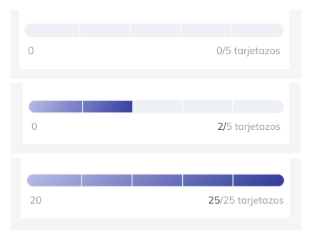

# Albo Challenge

**Objetivo**

El propósito de este challenge es evaluar tus habilidades y conocimientos en el desarrollo
de aplicaciones Android, específicamente en áreas como arquitectura de aplicaciones, uso
de librerías, y manejo de inyección de dependencia.

### Formato del Challenge

- Crearás un repositorio público en GitHub para este challenge.
- En el README.md del repositorio, responderás a una serie de preguntas teóricas.
- Agregarás archivos de código dentro del repositorio para demostrar tus habilidades
prácticas resolviendo ejercicios específicos relacionados con el desarrollo de
Android.

### Componentes del Challenge

**Preguntas Teóricas**
Responde las preguntas teóricas listadas en el README.md del repositorio. Tus respuestas
deben reflejar tu comprensión de los conceptos clave en el desarrollo de Android.

**Ejercicios de Código**

- Para cada ejercicio práctico proporcionado, incluirás archivos de código en el
repositorio. Estos archivos deben contener fragmentos de código necesarios para
resolver los ejercicios propuestos, junto con comentarios explicativos cuando sea
necesario.

**Documentación**

- Asegúrate de documentar adecuadamente tu código y respuestas. La claridad y
calidad de la documentación también formarán parte de la evaluación.

**Evaluación**

- Se evaluará tu capacidad para responder a preguntas teóricas de manera clara y
precisa.

- La calidad, eficiencia, y legibilidad de tu código serán criterios clave en la evaluación.

- La capacidad de aplicar buenas prácticas de desarrollo y patrones de diseño en tus
soluciones será un aspecto importante.

**Instrucciones Finales**

- Una vez completado el challenge, proporciona el enlace a tu repositorio para su
revisión.

Asegúrate de que tu repositorio sea público y accesible para que podamos revisar tu
trabajo.

## Challenge

### Preguntas Teóricas

Explique los principios de la arquitectura MVVM. ¿Por qué es preferible sobre MVC en
desarrollo Android?

Describa cómo Koin facilita la inyección de dependencia en aplicaciones Android.
Compare Retrofit y Volley para realizar llamadas de red en Android. ¿Cuáles son las
ventajas de usar uno sobre el otro?

### Ejercicios Prácticos con Código

**ViewModel y LiveData**

- Proporcione un fragmento de código para un ViewModel que maneje una operación
de red asincrónica utilizando LiveData.

- Explique cómo se gestionaría el ciclo de vida de este ViewModel en una actividad.
Inyección de Dependencia:

- Escriba un ejemplo de cómo se usaría Koin para inyectar una dependencia en un
ViewModel.

**Uso de Retrofit**

- Muestre un ejemplo de cómo crear un servicio web con Retrofit para consumir una
API REST.

**Ejemplo de UI**

- Demuestra tus habilidades de UI desarrollando el siguiente componente. Es una
barra de progreso que puede estar vacía, en cualquier punto intermedio y totalmente
llena.

### Preguntas de Resolución de Problemas

- Dada una situación donde una aplicación Android se enfrenta a problemas de
memoria debido al manejo incorrecto de contextos, ¿cómo lo solucionaría?

- Si una aplicación experimenta retardos debido a operaciones de red en el hilo
principal, ¿cómo optimizaría el código?

### Caso de Estudio

- Presente un escenario específico (por ejemplo, una aplicación de lista de tareas) y
pida al candidato que esboce cómo estructurarían la aplicación utilizando MVVM,
LiveData, Room, Koin y Retrofit.

- Pueden incluir diagramas de arquitectura y fragmentos de código para explicar su
enfoque.