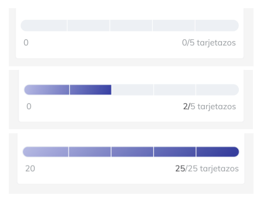

# Albo Challenge

**Goal**

The purpose of this challenge is to evaluate your skills and knowledge in the development
of Android applications, specifically in areas such as application architecture, use
of libraries, and dependency injection management.

### Challenge format

- You will create a public repository on GitHub for this challenge.

- In the README.md of the repository, you will answer a series of theoretical questions.

- You will add code files within the repository to demonstrate your skills
  practices solving specific exercises related to the development of
  Android.

### Challenge Components

**Theoretical Questions**
Answer the theoretical questions listed in the README.md of the repository. Your answers
They should reflect your understanding of key concepts in Android development.

**Code Exercises**

- For each hands-on exercise provided, you will include code files in the
  repository. These files must contain code fragments necessary to
  solve the proposed exercises, along with explanatory comments when necessary
  necessary.

**Documentation**

- Make sure you properly document your code and responses. The clarity and
  Quality of documentation will also be part of the evaluation.

**Assessment**

- Your ability to answer theoretical questions clearly and will be evaluated.
  precise.

- The quality, efficiency, and readability of your code will be key criteria in the evaluation.

- The ability to apply good development practices and design patterns in your
  solutions will be an important aspect.

**Final Instructions**

- Once the challenge is completed, provide the link to your repository for its
  revision.

Make sure your repository is public and accessible so we can review your
job.

## Challenge

### Theoretical Questions

Explain the principles of MVVM architecture. Why is it preferable over MVC in
Android development?

Describe how Koin facilitates dependency injection in Android applications.
Compare Retrofit and Volley for making network calls on Android. Which are the
advantages of using one over the other?

### Practical Exercises with Code

**ViewModel and LiveData**

- Provide a code snippet for a ViewModel that handles an operation
  asynchronous network using LiveData.

- Explain how the lifecycle of this ViewModel would be managed in an activity.
  Dependency Injection:

- Write an example of how Koin would be used to inject a dependency into a
  ViewModel.

**Use of Retrofit**

- Show an example of how to create a web service with Retrofit to consume a
  REST API.

**UI example**

- Demonstrate your UI skills by developing the following component. Is a
  progress bar that can be empty, at any point in between and completely
  full.

### Troubleshooting Questions

- Given a situation where an Android application is facing problems
  memory due to incorrect handling of contexts, how would I fix it?

- If an application experiences delays due to network operations in the thread
  Mainly, how would I optimize the code?

### Case study

- Present a specific scenario (for example, a to-do list application) and
  ask the candidate to outline how they would structure the application using MVVM,
  LiveData, Room, Koin and Retrofit.

- They may include architecture diagrams and code snippets to explain their
  approach.