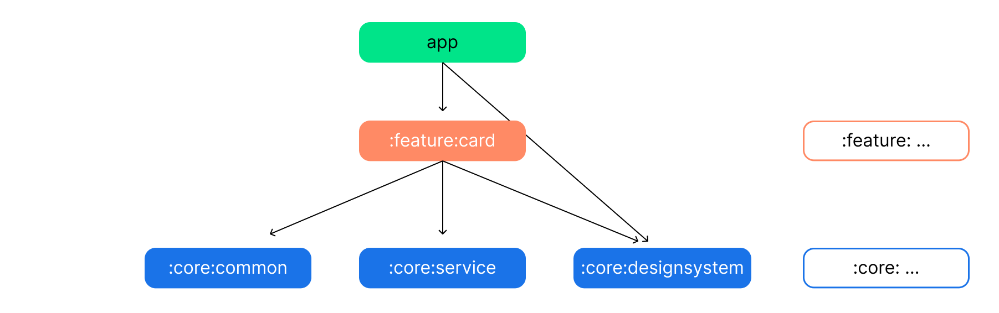

# Viaje de aprendizaje de modularización

En este viaje de aprendizaje aprenderá sobre la modularización y la estrategia de modularización utilizada.
para crear los módulos en la aplicación Albo Challenge.

## Descripción general

La modularización es la práctica de dividir el concepto de una base de código monolítica de un módulo en
Módulos autónomos y acoplados libremente.

### Beneficios de la modularización

Esto ofrece muchos beneficios, que incluyen:

**Escalabilidad**: en una base de código estrechamente acoplada, un solo cambio puede desencadenar una cascada de
alteraciones. Un proyecto adecuadamente modularizado abarcará
la [separación de preocupaciones](https://en.wikipedia.org/wiki/Separation_of_concerns) principio. Este
a su vez, otorga a los contribuyentes más autonomía y al mismo tiempo hace cumplir los patrones arquitectónicos.

**Permitir el trabajo en paralelo**: la modularización ayuda a disminuir los conflictos de control de versiones y permite
Trabajo más eficiente en paralelo para desarrolladores en equipos más grandes.

**Propiedad**: un módulo puede tener un propietario dedicado que sea responsable de mantener el código y
pruebas, corregir errores y revisar cambios.

**Encapsulación**: el código aislado es más fácil de leer, comprender, probar y mantener.

**Tiempo de compilación reducido**: aprovechar la compilación paralela e incremental de Gradle puede reducir los tiempos de compilación.

**Entrega dinámica**: la modularización es un requisito
para [Play Feature Delivery](https://developer.android.com/guide/playcore/feature-delivery) cual
permite que ciertas funciones de su aplicación se entreguen de forma condicional o se descarguen bajo demanda.

**Reutilizabilidad**: la modularización adecuada permite oportunidades para compartir código y crear múltiples
aplicaciones, en diferentes plataformas, desde la misma base.

### Errores de la modularización

Sin embargo, la modularización es un patrón que se puede abusar y hay algunas trampas que se deben tener en cuenta.
al modularizar una aplicación:

**Demasiados módulos**: cada módulo tiene una sobrecarga que se presenta en forma de mayor complejidad de
la configuración de compilación. Esto puede hacer que los tiempos de sincronización de Gradle aumenten e incurra en un problema continuo.
costo de mantenimiento. Además, agregar más módulos aumenta la complejidad del Gradle del proyecto.
configuración, en comparación con un único módulo monolítico. Esto se puede mitigar haciendo uso de
complementos de convención, para extraer la configuración de compilación reutilizable y componible en Kotlin con seguridad de tipos
código.

**No hay suficientes módulos** - por el contrario, si sus módulos son pocos, grandes y están estrechamente acoplados, terminará
con otro monolito más. Esto significa que se pierden algunos beneficios de la modularización. Si su módulo es
está inflado y no tiene un propósito único y bien definido, debería considerar dividirlo.

**Demasiado complejo**: aquí no existe una solución milagrosa. De hecho, no siempre tiene sentido modularizar
tu proyecto. Un factor dominante es el tamaño y la complejidad relativa del código base. Si tu
No se espera que el proyecto crezca más allá de un cierto umbral, la escalabilidad y el tiempo de construcción aumentan.
no se aplicará.

## Estrategia de modularización

Es importante tener en cuenta que no existe una única estrategia de modularización que se adapte a todos los proyectos.
Sin embargo, existen pautas generales que se pueden seguir para garantizar que se maximicen sus beneficios y
minimizar sus desventajas.

Un módulo barebone es simplemente un directorio con un script de compilación de Gradle en su interior. Sin embargo, normalmente un módulo
Consistirá en uno o más conjuntos de fuentes y posiblemente una colección de recursos o activos. Módulos
Se puede construir y probar de forma independiente. Debido a la flexibilidad de Gradle, existen pocas restricciones en cuanto a
cómo puedes organizar tu proyecto. En general, debe esforzarse por lograr un bajo acoplamiento y una alta cohesión.

* **Bajo acoplamiento** - Los módulos deben ser lo más independientes posible entre sí, para que los cambios
  a un módulo tienen un impacto nulo o mínimo en otros módulos. No deben poseer conocimientos de
  el funcionamiento interno de otros módulos.

* **Alta cohesión**: un módulo debe comprender una colección de código que actúa como un sistema. Debería
  tener responsabilidades claramente definidas y permanecer dentro de los límites de cierto dominio de conocimiento.

## Tipos de módulos en Albo Challenge

**Consejo principal**: Un gráfico de módulo (que se muestra arriba) puede ser útil durante la planificación de la modularización para
visualizar dependencias entre módulos.

La aplicación Albo Challenge contiene los siguientes tipos de módulos:

* El módulo `app`: contiene clases de andamiaje y nivel de aplicación que unen el resto del código base.
  como `MainActivity`, `App`. El módulo `app` depende de todos los módulos `feature` y
  módulos `core` requeridos.

* Módulos `feature:`: presenta módulos específicos cuyo alcance es manejar una sola responsabilidad
  en la aplicación. Estos módulos pueden ser reutilizados por cualquier aplicación, incluidas las de prueba u otras aplicaciones con sabor, cuando
  necesario, sin dejar de mantenerlo separado y aislado. Si una clase solo es necesaria para una `feature`
  módulo, debe permanecer dentro de ese módulo. Si no, se debe extraer en un
  módulo `core` apropiado. Un módulo de `feature` no debe depender de otras funciones
  módulos. Sólo dependen de los módulos `core` que requieren.

* módulos `core:`: módulos de biblioteca comunes que contienen código auxiliar y dependencias específicas que
  deben compartirse entre otros módulos de la aplicación. Estos módulos pueden depender de otros núcleos.
  módulos, pero no deberían depender de las funciones ni de los módulos de la aplicación.
